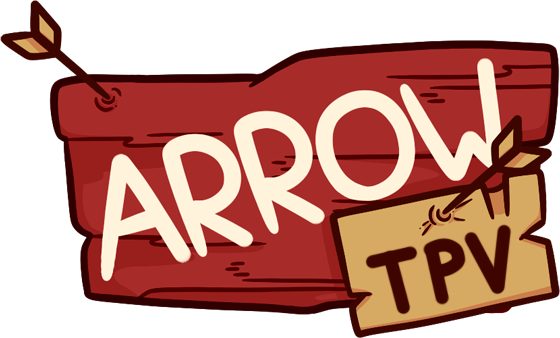

  

Arrow es un juego arcade donde el jugador dispara flechas para explotar globos y atrapar premios, creado como práctica para la asignatura de Tecnologías de Programación de Videojuegos en C++ con la librería SDL.

## Características técnicas

- Implementación de una **arquitectura escalable** para el manejo de **estados del juego**.
- Uso de **herencia** y **polimorfismo** en la creación de una jerarquía de clases para representar los elementos del juego.
- Manejo de eventos mediante una lista de **manejadores de eventos**.
- Integración de **menús interactivos** controlados por ratón.
- Implementación de una **máquina de estados** para gestionar transiciones entre menús y el juego principal.
- Eficiente **gestión de recursos gráficos**, como texturas y renderización de objetos, mediante la **carga desde archivos** .txt.
- Soporte para **guardar y cargar partidas**, mejorando la experiencia del usuario.
- Carga de la **configuración del juego** desde un archivo, permitiendo ajustar parámetros sin recompilar.
- Uso del **paquete TTF de SDL** para manejar textos en la interfaz de usuario y mensajes del juego.
- **Implementación de excepciones** para manejar errores y mejorar la robustez del juego.

## Gameplay

El objetivo principal del juego es **explotar globos** disparando flechas para acumular puntos. Al mismo tiempo, el jugador puede **atrapar premios** que otorgan ventajas, como flechas adicionales o mejoras en el arco. **Avanzar de nivel** se logra al alcanzar una cierta puntuación. La meta final es mantenerse vivo el mayor tiempo posible mientras se persigue la **puntuación más alta**.

## Controles

- **W, S o flechas de dirección arriba y abajo**: movimiento del arco.
- **Q, E**: ajuste del ángulo de la flecha.
- **A o flecha izquierda**: cargar flecha (mantener para aumentar velocidad).
- **D o flecha derecha**: disparar flecha.
- **Tecla "Esc"**: menú de pausa.
- **Click derecho del ratón**: recoger power-ups e interactuar con menús.

---
---

  

Arrow is an arcade game where the player shoots arrows to explode balloons and catch prizes, created as an exercise for the Video Game Programming Technologies subject in C++ with the SDL library.

## Technical features

- Implementation of a **scalable architecture** for **game state** management.
- Use of **inheritance** and **polymorphism** in the creation of a class hierarchy to represent game elements.
- Event handling through a list of **event handlers**.
- Integration of mouse-controlled **interactive menus**.
- Implementation of a **state machine** to manage transitions between menus and the main game.
- Efficient **management of graphical resources**, such as textures and object rendering, by loading from .txt files.
- Support for **saving and loading games**, improving the user experience.
- Load **game settings from a file**, allowing to adjust parameters without recompiling.
- Use of **SDL's TTF package** to handle UI text and in-game messages.
- **Implementation of exceptions** to handle errors and improve the robustness of the game.

## Gameplay

The main objective of the game is to **pop balloons** by shooting arrows to collect points. At the same time, the player can **catch prizes** that grant advantages, such as additional arrows or bow upgrades. **Level advancement** is achieved by reaching a certain score. The ultimate goal is to stay alive as long as possible while chasing the **highest score**.

## Controls

- **W, S or up and down arrows**: bow movement.
- **Q, E**: arrow angle adjustment.
- **A or left arrow**: load arrow (hold to increase speed).
- **D or right arrow**: fire arrow.
- **Esc key**: pause menu.
- **Right mouse click**: collect power-ups and interact with menus.

